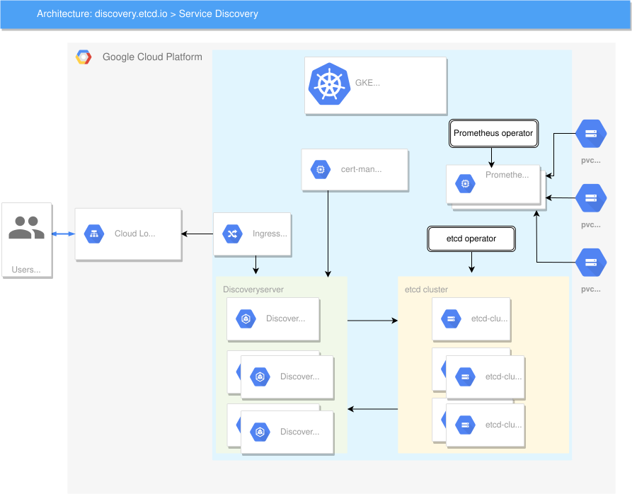

## Public metrics

Public metrics are hosted at: https://grafana.prod.discovery.etcd.io/d/uiLwPyPWk/discoveryserver?orgId=2

## discovery.etcd.io Kubernetes Configurations

This repo contains the code to provision the infrastructure and the Kubernetes configurations to operate the public discovery.etcd.io service.

## Requirements

  * **Helm**  ~> v3.0.0 - Install latest [version](https://github.com/helm/helm/releases) for your OS.
  * **Terraform ~> v0.12.15**  Please [download](https://www.terraform.io/downloads.html) the proper package for your operating system and architecture.

## Building the infrastructure

The infrastructure is built using cloudkite [terraform modules](https://github.com/cloudkite-io/terraform-modules), which are used to provision infrastructure in Google Cloud Platform.
The following modules have been used:

* [vpc](https://github.com/cloudkite-io/terraform-modules/tree/master/modules/gcp/vpc): The vpc module contains Terraform code 
  to provision a GCP Virtual Private Cloud. See [VPC docs](https://cloud.google.com/vpc/docs/).

* [gke](https://github.com/cloudkite-io/terraform-modules/tree/master/modules/gcp/gke): The folder contains Terraform code to deploy a GKE Private Cluster.

### Provisioning a VPC and deploying a GKE cluster per environment

The infrastructure main code is created per environment, and there are two environments:
* [dev](https://github.com/etcd-io/discovery.etcd.io/tree/master/terraform/dev)
* [prod](https://github.com/etcd-io/discovery.etcd.io/tree/master/terraform/prod)

Choose an environment - that is, move to the `dev` or to `prod` folder in order to run Terraform commands.

Next step is to apply Terraform for the chosen environment. To ensure that it is configured correctly, apply it and get the expected output, go to the project's [terraform folder](https://github.com/etcd-io/discovery.etcd.io/tree/master/terraform)
and follow the [README](https://github.com/etcd-io/discovery.etcd.io/blob/master/terraform/README.md) instructions.

#### Manual Step
The discoveryserver image is published to Artifact Registry in the `etcd-io-dev` project
(`us-docker.pkg.dev/etcd-io-dev/discoveryserver`), as gcr.io / Container Registry was shut down by Google in 2025.
For clusters to pull it, the gke_service_accounts of both environments must have the role
`roles/artifactregistry.reader` on that repository (prod pulls cross-project from `etcd-io-dev`).

gcloud command to grant the role:

`gcloud artifacts repositories add-iam-policy-binding discoveryserver --location=us --project=etcd-io-dev --member="serviceAccount:[SERVICE_ACCOUNT_EMAIL]" --role=roles/artifactregistry.reader`

After applying terraform, a GKE cluster will be up and running in the VPC created. Now the cluster is ready to get deployments.

## Install Releases with Helm

To get the public discovery service running, the following releases have to be installed:

* [Nginx Ingress Controller](https://github.com/etcd-io/discovery.etcd.io/tree/master/kubernetes/helm/nginx-ingress): Used for routing 
traffic from beyond the cluster to internal Kubernetes Services. To install follow instructions in [README](https://github.com/etcd-io/discovery.etcd.io/blob/master/kubernetes/helm/nginx-ingress/README.md).
* [certmanager](https://github.com/etcd-io/discovery.etcd.io/tree/master/kubernetes/helm/cert-manager): Is the TLS/SSL certificate management controller, and to
get it deployed follow the [README](https://github.com/etcd-io/discovery.etcd.io/blob/master/kubernetes/helm/cert-manager/README.md).
* [etcd-operator](https://github.com/etcd-io/discovery.etcd.io/blob/master/kubernetes/helm/etcd-operator): Is used to configure and manage etcd clusters. This is a
pre-requisite to have configured properly the discoveryserver release. To install it follow instructions in [README](https://github.com/etcd-io/discovery.etcd.io/blob/master/kubernetes/helm/etcd-operator/README.md).
* [discoveryserver](https://github.com/etcd-io/discovery.etcd.io/blob/master/kubernetes/helm/discoveryserver): Is a service that bootstrap new etcd clusters using an existing one.
This service helps when the IPs of your cluster peers are not known ahead of time. To install the release follow instructions in [README](https://github.com/etcd-io/discovery.etcd.io/blob/master/kubernetes/helm/discoveryserver/README.md).



## Debugging

**Hit the discovery service via kubectl proxy**

```
kubectl proxy
curl http://localhost:8001/api/v1/namespaces/default/services/discoveryserver/proxy/new
```

**Execute etcdctl on the cluster**

```
kubectl exec -it $(kubectl get pods -l app=etcd -o jsonpath='{.items[0].metadata.name}')  -- /usr/local/bin/etcdctl watch '' --prefix
```


